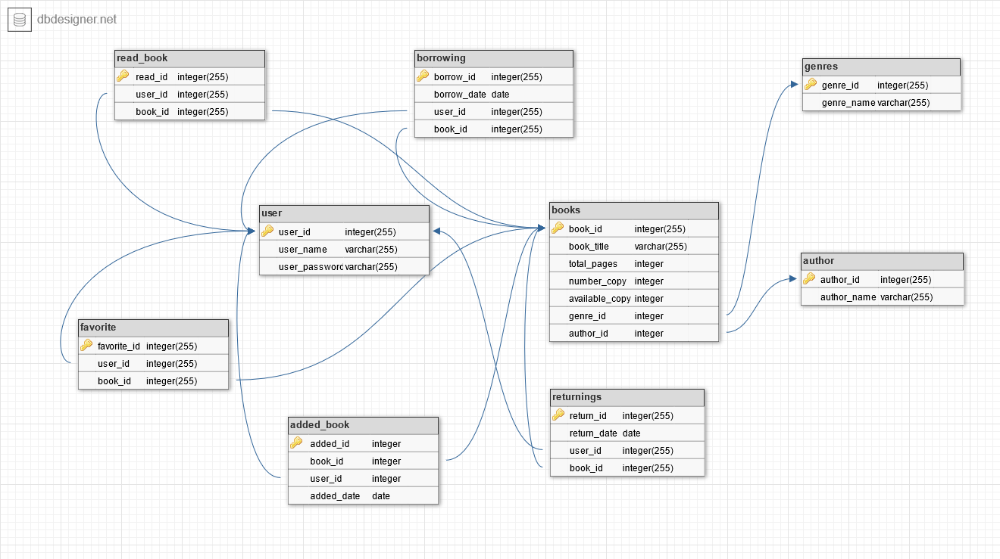

# Library CLI

## Description:

This application is a command-line interface to manage a local library. Where users can search for books, add books, view their read and favorite books, and borrow books.

## Installation:

1. Install python.

2. Install the requirements:
```bash
pip install -r requirements.txt
```
3. Start a database:
```bash
python3 main.py start
```

## Usage and Commands:
```bash
 Usage: main.py [OPTIONS] COMMAND [ARGS]...

╭─ Options ─────────────────────────────────────────────────────────────────────────────────────────────────────────╮
│ --install-completion          Install completion for the current shell.                                           │
│ --show-completion             Show completion for the current shell, to copy it or customize the installation.    │
│ --help                        Show this message and exit.                                                         │
╰───────────────────────────────────────────────────────────────────────────────────────────────────────────────────╯
╭─ Commands ────────────────────────────────────────────────────────────────────────────────────────────────────────╮
│ add_book             it provides the user to add any book to the library.But the user has to signed in first.     │
│ borrow_book          it provides the user to borrow any book from the library.But the user has to signed in       │
│                      first.                                                                                       │
│ del_database         Delete the current database. User start after to create a new one.                           │
│ fav_book             it enables the user to mark any book as favorite.But the user has to signed in first.        │
│ mark_read            it enables the user to mark any book as read.But the user has to signed in first.            │
│ most_favorite_books  it displays the most favored books by the users of the library.                              │
│ most_read_authors    it displays the most read authors and their number.                                          │
│ most_read_books      it displays the most read books by users of the library.                                     │
│ most_read_genres     it displays the most read genres and their number.                                           │
│ my_books             it displays all the books of a user in a two table, read and favorite.But the user has to    │
│                      signed in first.                                                                             │
│ recently_added       displays all the books in the library with the most recent on the top.                       │
│ return_book          it provides the user to return the book he/she borrowed.But the user has to signed in first. │
│ search_by_author     search a book by the author name and displays it with its detail information.                │
│ search_by_name       search a book by its title and displays it with its detail information.                      │
│ sign_up              Registers a new user with username and password. if the username is occupied, it notifys and │
│                      provide the user for another input.                                                          │
│ start                Check if the database is available, and if not create a new database.                        │
│ statistics           it displays summary of all the books the user read in terms of number of books,              │
│                      authors,genres and pages.But the user has to signed in first.                                │
╰───────────────────────────────────────────────────────────────────────────────────────────────────────────────────╯
```

## Screenshots:
### search_by_name 'SEARCH WORDS'
```bash
python3 main.py search_by_name 'of'
```


### search_by_author 'AUTHOR NAME'
```bash
python3 main.py search_by_author 'george'
```


### most_read_books 'GENRE NAME'
```bash
python3 main.py most_read_books 'Fiction'
```


### add_book
```bash
python3 main.py add_book
```


### borrow_book BOOK_ID
```bash
python3 main.py borrow_book 4
```


### my_books
```bash
python3 main.py my_books
```


### statistics
```bash
python3 main.py statistics
```


## Entity-relationship diagram (ERD):



## Collaborators/team members:

Project given by: [Fenyx IT Academy](https://github.com/fenyx-it-academy)

### Team members:

[Elena Kostina](https://github.com/elen-ladder)

[Haftom Zewde Lemlem](https://github.com/HaftomZ)

[Ziad Jradeh](https://github.com/ziad-jradeh)


